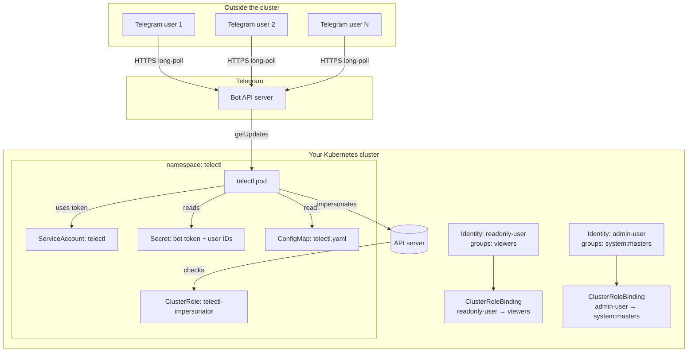
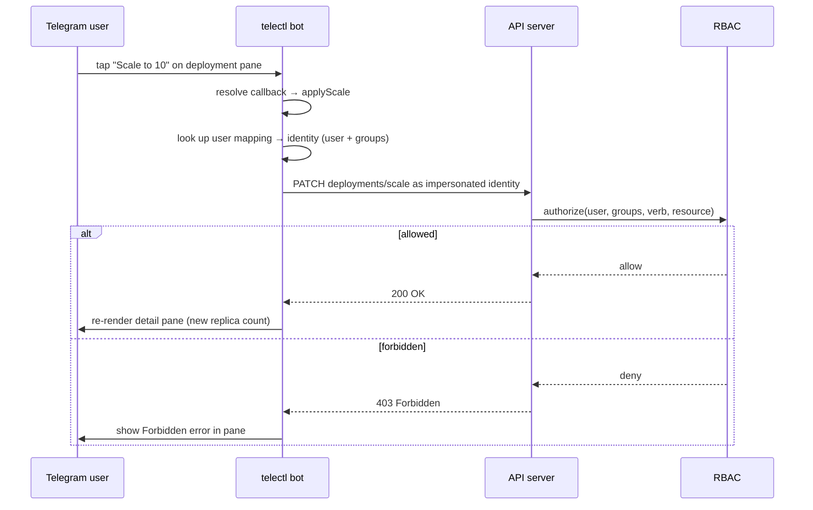
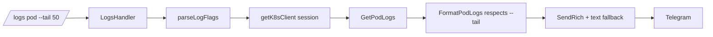

# Architecture Overview

telectl is a **direct-API** Kubernetes bot: the binary runs inside (or next
to) your cluster and talks to the API server with client-go. No agent pods,
no webhook relays, no kubectl subprocesses — every operation is a native
Kubernetes API call.

## Component Diagram



## Request Flow (mutating action, e.g. scale)



## Key Design Decisions

| Decision | Why |
|----------|-----|
| **Direct API, no kubectl** | One binary, no subprocess management, typed clients |
| **Impersonation for per-user RBAC** | The bot holds one ServiceAccount; each Telegram user is mapped to a k8s identity, and **Kubernetes RBAC decides** what they may do |
| **Single message pane** | Menu navigation edits one message in place; verbs render into the pane (TUI-style) |
| **Rich messages with plain fallback** | Native tables/headings where the Bot API supports them; graceful fallback to text |
| **GHCR multi-arch images** | `linux/amd64` + `linux/arm64` built with buildx `TARGETARCH` |

## Data Flow for a Typed Command



## Package Layout

```
cmd/telectl/          entrypoint (Cobra CLI)
internal/bot/         bot core: callbacks, panes, detail verbs
internal/handlers/    typed command handlers (logs, exec, scale, restart…)
internal/k8s/         client-go wrapper, impersonated clients
internal/config/      viper config, impersonation mapping
internal/menus/       menu/keyboard builders, callback token store
internal/tg/          Telegram transport, rich messages
internal/types/       shared types, resource map
internal/utils/       formatters, helpers
charts/telectl/       Helm chart
```

---

Next: [How It Works](How-It-Works) · [Impersonation & RBAC](Impersonation-and-RBAC)