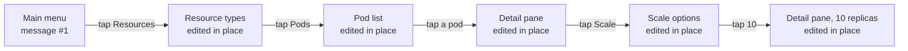
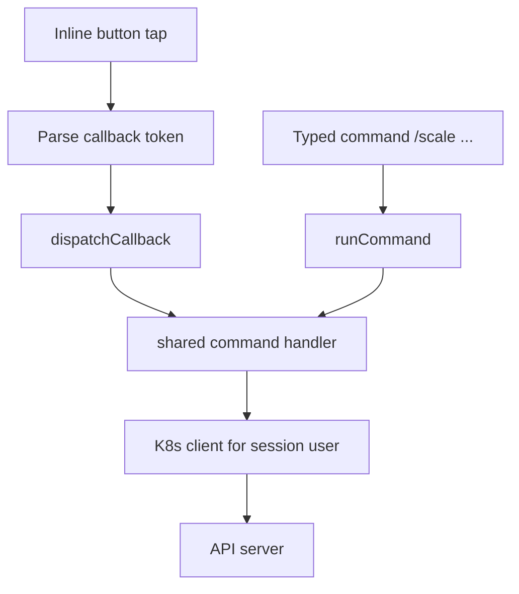
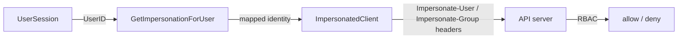
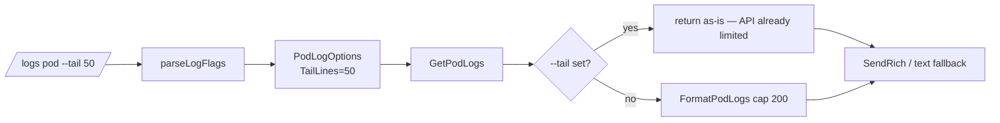

# How It Works

This page walks through the internals: how a tap on a button becomes a
Kubernetes API call, how sessions work, and how the menu system is wired.

## The Single Pane Model

Every menu interaction happens in **one message**, which is edited in place.
Tapping a button never sends a new message — it *edits* the message the button
lives on. This is a deliberate TUI-style design:



**Consequences:**

- Output is transient — the pane shows current state, like a TUI.
- A rendered pane must fit **one message** (Telegram cap ≈ 4096 chars), so
  long output is truncated with a pointer to the typed command that prints it
  in full.
- For **logs**, truncation keeps the *newest* lines (the tail), never the head.

## Two Entry Points, One Implementation

Buttons and typed commands share the same handlers, so behaviour cannot drift:



Callback data over 64 bytes is stored server-side in a token store; the button
carries a short token, expanded before parsing (Telegram rejects long
`callback_data`).

## Sessions

Each Telegram user gets a `UserSession` (held in memory):

- `UserID` — the Telegram user id
- `CurrentNS` — the session's active namespace
- `MenuState` — current view, resource type, page
- `State` — per-session scratch state (e.g. exec sessions)

The session is what ties a callback to the *user's* impersonated identity.

## Impersonation Pipeline



The mapping is **config**, not code:

```yaml
impersonation:
  enabled: true
  defaultUser: "system:serviceaccount:default:readonly"
  defaultGroups: ["viewers"]
  userMapping:
    "YOUR_ADMIN_TELEGRAM_ID":
      user: "admin-user"
      groups: ["system:masters"]
    "YOUR_READONLY_TELEGRAM_ID":
      user: "readonly-user"
      groups: ["viewers"]
```

The bot holds one ServiceAccount (`telectl`) which is granted
`impersonate` on the mapped identities. Every request then carries
`Impersonate-User: <user>` + `Impersonate-Group: <groups>` headers, and the
API server enforces RBAC **for that identity**. The bot contains **zero**
hardcoded allow/deny logic.

## Logs Pipeline



**Fix note:** earlier versions hardcoded a 100/200-line cap that overrode
`--tail`, and pane truncation kept the *head* of long log bodies — silently
discarding the newest lines. Both are fixed: `--tail` is respected, and log
panes truncate from the tail.

## Command Routing

| Path | Handler |
|------|---------|
| `/logs`, `/logs -f`, `/logs -p` | `LogsHandler` |
| `/exec` | `ExecHandler` (interactive sessions + one-shot) |
| `/scale` / `/restart` | `RestartHandler` / `ScaleHandler` |
| `/get`, `/describe`, `/top`, `/events` | typed + menu verbs |
| `contexts`, `use-context`, `config` | context management |

## Rate Limiting & Allowed Users

- `telegram.allowedUserIds` — who may talk to the bot at all
- `telegram.adminUserIds` — admin-marked users (menu/UI hints)
- `bot.rateLimit` — requests per user per minute

---

Next: [Impersonation & RBAC](Impersonation-and-RBAC) · [Architecture Overview](Architecture-Overview)