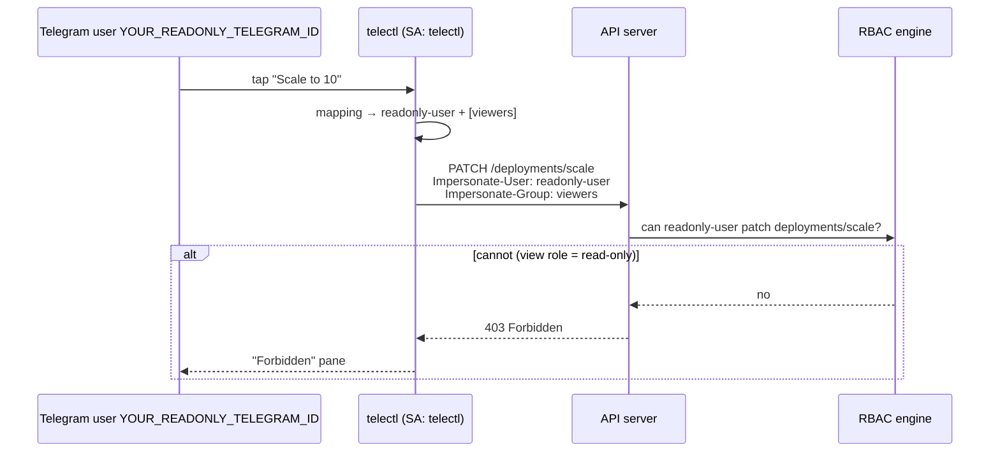

# Impersonation & RBAC

The security model in one sentence: **the bot never decides who may do what —
Kubernetes RBAC does.**

## The Problem

A naive bot uses one ServiceAccount for everything. Every Telegram user then
gets whatever that ServiceAccount can do (usually too much), and there is no
per-user auditing.

## The Solution: Impersonation

Kubernetes' [user impersonation](https://kubernetes.io/docs/reference/access-authn-authz/authentication/#user-impersonation)
lets an authenticated client make a request **as another identity** by setting
`Impersonate-User` / `Impersonate-Group` headers — *provided* it is permitted
to do so. telectl uses exactly this:



## RBAC Objects (created by the Helm chart)

| Object | Purpose |
|--------|---------|
| `ClusterRole: telectl` | base permissions for the bot's own SA (read + impersonate) |
| `ClusterRole: telectl-impersonator` | `impersonate` on the mapped identities |
| `ClusterRole: readonly-user` | read-only role (get/list/watch on core + apps resources) |
| `ClusterRoleBinding: readonly-user-group` | binds `readonly-user` role to the **`viewers` group** |
| `ClusterRoleBinding: admin-user` | binds `cluster-admin` (via `system:masters`) to the admin identity |

## The `viewers` Group Binding — Why It Matters

A common mistake is binding the read-only role to the *ServiceAccount*
`system:serviceaccount:default:readonly-user`, while the bot impersonates the
plain *user* `readonly-user`. Those are **different identities**, and the
impersonated one ends up with zero bindings — unable to read anything.

The chart binds the role to the **`viewers` group** instead, which is what the
bot impersonates as a group for read-only users. This makes the mapping robust:
whatever user the bot impersonates, the group membership carries the role.

## Adding / Changing a User's Permissions

**No code change, no redeploy.** The bot reads the mapping from config; the
permissions come from RBAC bindings.

```bash
# Promote the read-only user to full admin (one command):
kubectl create clusterrolebinding readonly-user-admin \
  --clusterrole=cluster-admin \
  --user=readonly-user

# Or tighten: edit the readonly-user ClusterRole
kubectl edit clusterrole readonly-user
```

The next action from that user immediately reflects the new role.

## Operational Notes

- The bot's own SA needs `impersonate` on exactly the identities in the
  mapping — keep that ClusterRole scoped with `resourceNames`.
- Audit trail: the bot logs `telegram_user_id`, the impersonated
  user/groups, and the action for every mutating operation.
- `impersonation.defaultUser` / `defaultGroups` are the fallback for users
  not listed in `userMapping`.
- Disable impersonation (`impersonation.enabled: false`) → all users act as
  the bot's base SA.

## Verification Snippets

```bash
# Who can the bot impersonate?
kubectl auth can-i --list --as=system:serviceaccount:default:telectl | grep impersonate

# Simulate a read-only user's request (as the bot SA):
kubectl --as=system:serviceaccount:default:telectl \
  get pods -n production --as=readonly-user --as-group=viewers

# Expect: read OK
kubectl --as=system:serviceaccount:default:telectl \
  scale deploy frontend -n production --replicas=5 \
  --as=readonly-user --as-group=viewers
# Expect: Forbidden
```

---

Next: [How It Works](How-It-Works) · [Security](Security)