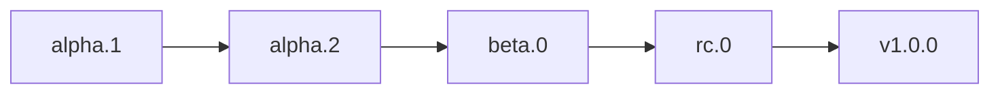

# Release Process

How telectl versions and ships releases.

## Version scheme

telectl follows **Semantic Versioning 2.0** with Kubernetes-style pre-release
stages:

```
v<major>.<minor>.<patch>-<stage>.<n>
```

The ladder: `alpha.N → beta.N → rc.N → stable` (no suffix).



**Tags are immutable.** A broken release is never deleted and re-tagged with
the same number — it gets the *next* number. History is history; `v0.1.0-alpha.1`
stays in the release list even after `v0.1.0-alpha.2` and `v0.1.0-beta.0`
ship. See [Versioning & Releases](Versioning-and-Releases) for the full
rationale.

## What a release contains

- GitHub Release with binaries for 5 platforms (linux/macos/windows ×
  amd64/arm64), each with SHA256 checksums.
- GHCR image `ghcr.io/ksauraj/telectl:<tag>` — multi-arch (amd64 + arm64),
  compiled per `TARGETARCH` in the Dockerfile.
- CHANGELOG.md entry under a new version header.

## How a release is cut

1. **Update CHANGELOG.md** — add `## [vX.Y.Z-stage.n] - <date>` with
   Added/Changed/Fixed sections describing the release.
2. **Commit** the changelog (`docs:` conventional commit).
3. **Tag** the commit and push the tag:
   ```bash
   git tag v0.1.0-beta.0
   git push origin v0.1.0-beta.0
   ```
   Pushing a tag triggers the CI release pipeline.
4. **CI builds and publishes** — the workflow:
   - runs the full test/lint/build suite,
   - builds the multi-platform Docker image and pushes to GHCR,
   - builds release binaries for all platforms,
   - creates the GitHub Release via `softprops/action-gh-release` with
     checksums attached.
5. **Verify** — the release page shows binaries + checksums; the GHCR
   package shows the new tag; both platforms' images are real binaries
   (the arm64 image contains an arm64 binary).

## Promoting stages

- Fixes to an existing pre-release → bump the number (`alpha.2` → `alpha.3`)
  or promote if the project is stable enough (`beta.0`).
- The decision to promote (alpha → beta → rc → stable) is a maintainer call,
  recorded in the CHANGELOG.
- Docs and wiki updates ride along in the same commit as the changelog so
  the release is self-consistent.

## Branch policy

- Development happens on feature branches; merges land on `main` via
  `--no-ff` merge commits.
- Tags are cut from `main` only.
- See [Branch Protection](https://github.com/ksauraj/telectl/blob/main/BRANCH_PROTECTION.md)
  in the repo for the protection rules.

## After release

- Announce the release (the GitHub Release notes double as the changelog).
- Update the Helm chart version to match when the chart itself changes
  (`charts/telectl/Chart.yaml` `version`), and re-publish the chart repo on
  GitHub Pages if so.