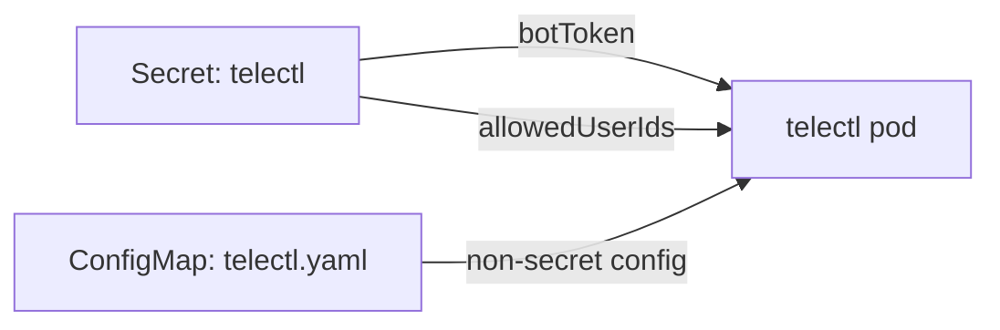

# Security

telectl's security posture and the operational checklist for deploying it
safely.

## Threat Model

- **The bot token** is the crown jewel — anyone with it can act as the bot.
  It lives in a Kubernetes Secret, never in the image or in plaintext config.
- **The bot's ServiceAccount** is a cluster credential. It should have the
  least privilege needed: read + impersonate the mapped identities. It must
  **not** have `cluster-admin` by default.
- **Telegram users** are scoped by impersonation → their mapped k8s identity
  → RBAC. A read-only user cannot mutate, even if the bot's own SA could.

## Secrets Handling (Helm)



- `telegram.botToken` is injected as a Secret (`stringData`), mounted into
  the pod.
- The Secret is kept on `helm uninstall` (`helm.sh/resource-policy: keep`)
  so a reinstall does not lose the token.
- Non-secret config (namespaces, impersonation mapping, logging) goes in the
  ConfigMap.

## Least-Privilege Checklist

1. **Impersonation on** — never run with everyone mapped to `cluster-admin`.
2. **Scoped impersonator role** — `resourceNames` should list exactly the
   identities in `impersonation.userMapping`.
3. **Read-only group binding** — bind the view role to the `viewers` group,
   not to a ServiceAccount the bot never impersonates.
4. **Dry-run mode** for unsafe environments — `kubernetes.dryRun: true`
   logs mutations without applying them.
5. **`allowedUserIds`** — restrict who can talk to the bot at all.
6. **Pod security** — the chart ships `runAsNonRoot`, dropped capabilities,
   read-only rootfs.
7. **Rate limiting** — `bot.rateLimit` bounds per-user request volume.

## Audit Trail

Every mutating action is logged with:

```
telegram_user_id  — who (Telegram user id)
impersonate_user  — the k8s identity acted as
impersonate_groups— the groups carried
action + resource + namespace + name
```

Example:

```json
{"level":"info","msg":"User action: scale resource",
 "telegram_user_id": YOUR_READONLY_TELEGRAM_ID,
 "resource_type":"deployments","namespace":"production","name":"frontend",
 "replicas":10}
```

`logging.level: info` (or `debug`) shows these in the pod logs.

## Reporting a Vulnerability

See the repository's
[SECURITY.md](https://github.com/ksauraj/telectl/blob/main/SECURITY.md) —
please report privately to the maintainers (email in the file) rather than
opening a public issue.

---

Next: [Impersonation & RBAC](Impersonation-and-RBAC) · [Troubleshooting](Troubleshooting)