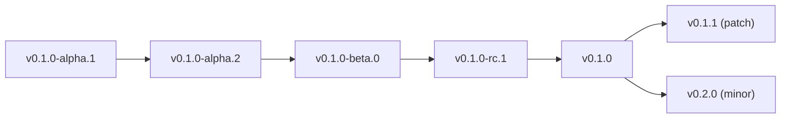
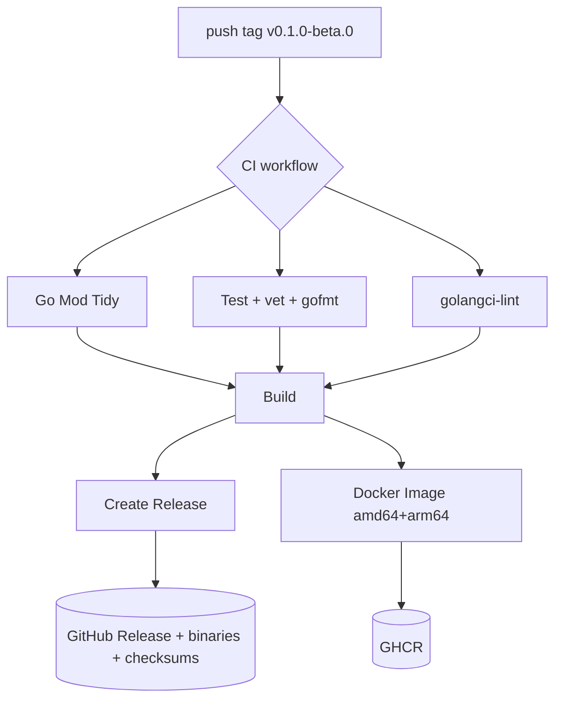

# Versioning & Releases

telectl follows **Semantic Versioning 2.0** with Kubernetes-style pre-release
stages.

## Version Scheme

```
v<major>.<minor>.<patch>[-<prerelease>]
```



| Stage | Meaning |
|-------|---------|
| `alpha.N` | Early preview; unstable; APIs may change |
| `beta.N` | Feature-complete; APIs stabilizing; limited production use |
| `rc.N` | Release candidate; production-ready pending final testing |
| (no suffix) | Stable release; semantic versioning guaranteed |

## Golden Rules

1. **Tags are immutable.** A broken release is fixed by the *next* version
   (`v0.1.0-alpha.1` broken → ship `v0.1.0-alpha.2`), never by deleting and
   re-pushing the same tag. Reusing a tag means anyone who already pulled it
   gets a different artifact than the tag claims — breaking reproducibility.
2. **Bump rules (SemVer):**
   - `major` — breaking API changes
   - `minor` — new features, backwards compatible
   - `patch` — backwards-compatible fixes
   - `prerelease` — incremented per pre-release (`.1`, `.2`, …)
3. **One release per tag push.** CI builds binaries, checksums, and the
   multi-arch GHCR image, then creates the GitHub Release.

## How a Release Happens (CI)



## Current Releases

| Version | Date | Notes |
|---------|------|-------|
| `v0.1.0-beta.0` | 2026-08-05 | table rendering + log tail fixes; RBAC-enforced actions |
| `v0.1.0-alpha.2` | 2026-08-05 | impersonation security fix, Docker TARGETARCH fix |
| `v0.1.0-alpha.1` | 2026-08-05 | initial alpha |

## Changelog

See [CHANGELOG.md](https://github.com/ksauraj/telectl/blob/main/CHANGELOG.md)
in the repository (Keep a Changelog format).

---

Next: [Architecture Overview](Architecture-Overview) · [Security](Security)