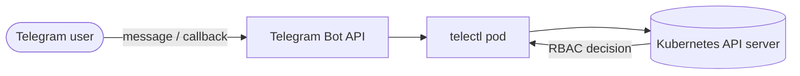

telectl is a **Telegram bot for Kubernetes cluster management**. Browse pods,
deployments, services and more; read logs; scale, restart and exec — all from
chat, with **per-user RBAC via Kubernetes impersonation**.



## 📚 Documentation

### Getting Started
- [Installation Guide](Installation-Guide) — binaries, Docker, Helm
- [Helm Chart Guide](Helm-Chart-Guide) — full Helm reference + RBAC + impersonation

### Architecture & Design
- [Architecture Overview](Architecture-Overview) — components, data flow, diagrams
- [How It Works](How-It-Works) — deep dive into menus, commands, sessions
- [Impersonation & RBAC](Impersonation-and-RBAC) — per-user permissions, the security model
- [Versioning & Releases](Versioning-and-Releases) — SemVer, K8s-style pre-releases

### Operations
- [Security](Security) — tokens, impersonation, least-privilege
- [Troubleshooting](Troubleshooting) — common issues

## 🔗 Quick Links
- [GitHub Repository](https://github.com/ksauraj/telectl)
- [Releases](https://github.com/ksauraj/telectl/releases)
- [GHCR Images](https://github.com/ksauraj/telectl/pkgs/container/telectl)

## ⚙️ Helm Chart Repository

Add the chart repo directly from GitHub Pages:

```bash
helm repo add telectl https://ksauraj.github.io/telectl/charts
helm repo update
helm install telectl telectl/telectl \
  --namespace telectl --create-namespace \
  --set telegram.botToken="YOUR_BOT_TOKEN"
```
